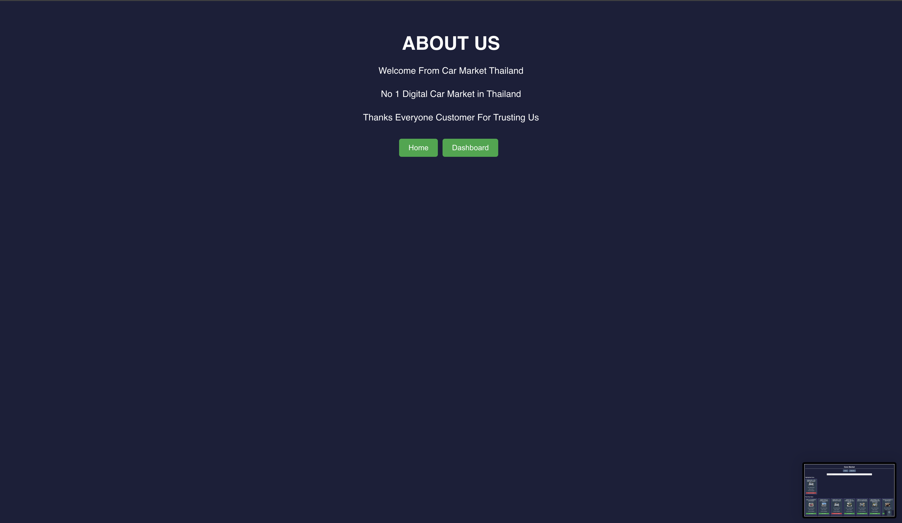

This project was build by 

1.San Nyunt Aung 
  u6531336 
  Computer Science

2.Sai Naing Yi Tun
  u6540191
  Computer Science

Car Market Analytics

Car Market Analytics is a comprehensive web application designed to provide users with detailed insights into the car market in Thailand. This platform allows users to explore various car models and brands through interactive visualizations, helping them make informed decisions when purchasing a vehicle.

Key Features:

	•	Interactive Dashboard:
	•	Cars by Model: Explore the distribution of cars across different models with a vibrant bar chart. Users can toggle the visibility of specific models to focus on the ones that matter most to them.
	•	Cars by Company: A colorful doughnut chart that displays the share of different car companies in the market, offering a quick overview of the most popular brands.
	•	Search and Highlight:
	•	Find Your Cars: A search functionality that allows users to filter cars based on criteria such as year, province, and price range. Users can also highlight cars of interest for easy comparison.
	•	Highlighted Cars: A section where users can view and manage the cars they have highlighted, making it simple to keep track of potential purchases.
	•	Responsive Design: The application is designed to work seamlessly across different devices, ensuring a smooth user experience whether you’re on a desktop or mobile device.
	•	Easy Navigation: Simple and intuitive navigation with a home page, dashboard, and about us section to provide users with all the necessary information about the car market in Thailand.

This is our home page which you will see as soon as enter the link . At this page you can see charts for cars with 
"Cars by Models" and "Cars by Brand"

!

!

This is the Dashboard Section where you can find your cars with search bar and yu can see not only highlighted cars but also all car models we have.

This is the about us page.

